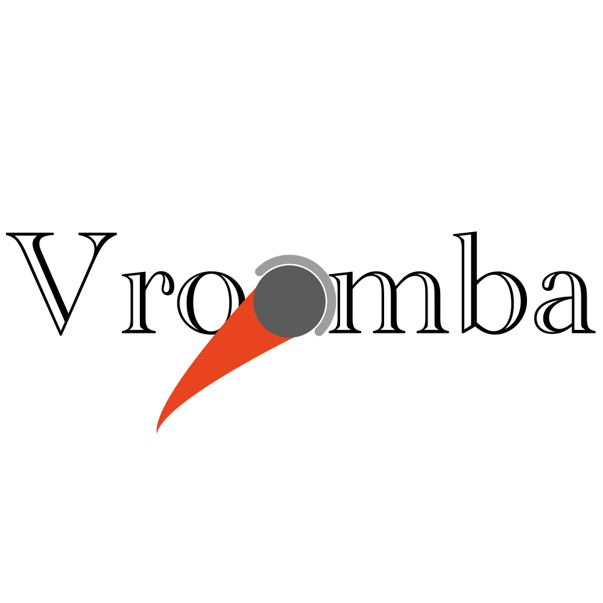

# **Vroomba**
Software that supercharges a Roomba 690's ability to clean effectively and efficiently

# Why?

My girlfriend wasn't satisfied with the cleaning performance of the roomba we bought, a Roomba 690. So I gathered a Raspberry Pi, my web and Python skills, and some caffiene, and started this project to make the cleaning performance better.

# What's in this package?
This package includes a web interface and an API for controlling a Roomba 690. It uses a modified version of the wonderful [PyRoombaAdapter](https://github.com/AtsushiSakai/PyRoombaAdapter) to handle serial communication to the robot. I extended the adapter to include bump and light sensing functionality, and added abstractions for obstacle sources, the robot itself, and eventually, I will add an abstraction for cleaning programs.

# What can it do right now? 
The web application, made with React, and the API, made with Flask, allow you to remotely drive the roomba and track its position. It's very janky right now, but I'm working on this in my spare time and I will improve it.

# What's to come?
A lot of things.
- Mapping, initially by using the bump and proximity sensors of the robot
  - Will also attempt VSLAM with a webcam. I want to try to roll my own before eventually using someone else's implementation.
- Vacuum path computing and cleaning algorithms
- Sock, cord, and pet waste avoidance
- Automatic cat chasing mode (this will come after I get VSLAM working.)